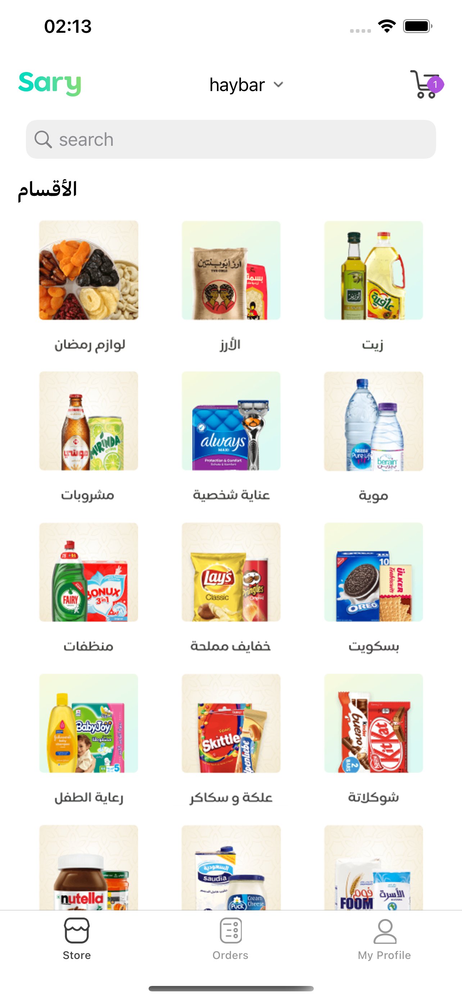

# Sary App Demo

A B2B Market place
<br />

<br />

  

https://user-images.githubusercontent.com/48877943/166127396-93d30a76-4cab-46cc-a40a-03e0c97e3071.mp4


## Consist Of
- Home Dashboard Screen

    
## Tech Stack
- UIKit
- RXSwift/RXCocoa
- Architectural pattern (MVVM-C)
- Clean Architecture
- Design Patterns (Coordinator - Repository - Builder)
- Unit Testing
    

## Used Pods
- FSPagerView for page slider
- SDWebImage for image caching
- RxSwift/RXCocoa

## Requirements
- iOS 11.0 or later.
- Xcode 13.0 or later.
    

## Installation
Dependencies in this project are provided via Cocoapods. Please install all dependecies with

```bash
pod install
```

if you are using Macbook M1, maybe you will face an error while executing the previous command, so you can try the following commands
```sh
sudo arch -x86_64 gem install ffi
arch -x86_64 pod install
```

    
## Authors

- [Mohamed Abdalla](https://www.linkedin.com/in/mohamed-abdallah-9a97b3b5/)

  


